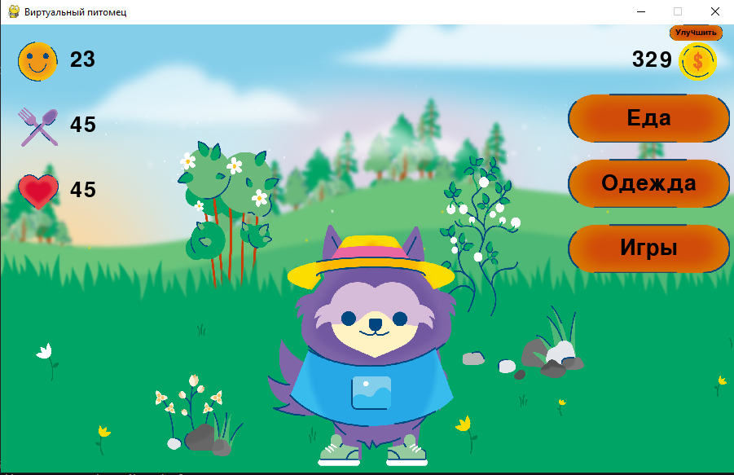

# Виртуальный питомец
- Учебный проект на Джанго, имитирующий игру
## Что можно делать в игре
- Кормить питомца
- Играть в игры
- Покупать одежду
- Улучшать
## Чему научился
- Универсальный класс для кнопок, которые можно использовать
в любой части текущего проекта и в других проектах тоже
## Работа игры
### Игра

### Магазин еды

### Магазин одежды

### Мини игра
